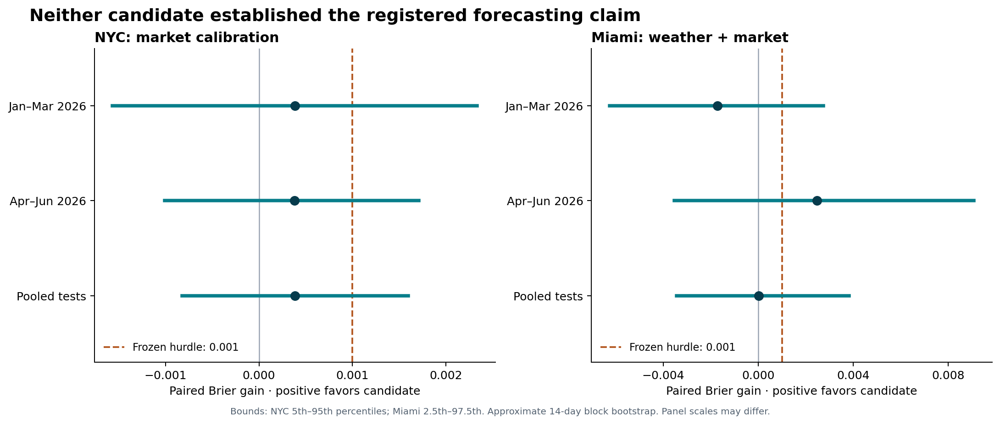

# Prediction Market Engine — research handoff

This repository contains the current research documentation, completed study results, and reproducible evidence. **Neither tested candidate established a validated forecasting edge.** No production evaluation engine or trading system has been built.

Start with **[HANDOFF.md](HANDOFF.md)**. It gives the next agent the current authority, reading order, findings, exposed-data boundaries, reproduction paths, and unresolved work.

## Current task and scope

The user authorized this repository and the documentation handoff in [D0007](docs/decisions/D0007-repository-handoff.md), replacing the proposed diagnostic task. Repository setup is now authorized; production-engine development remains deferred. The diagnosis was interrupted before findings. No third experiment, paid activity, trading, or recurring collection is active.

The scientific decision remains [D0006](docs/decisions/D0006-two-study-evidence-decision.md): stop the initial two-study evaluation and revise the research direction. A repository import does not change that evidence decision.

## Results

| Study | Fixed method | Eligible test days | Pooled Brier gain | Finding |
| --- | --- | ---: | ---: | --- |
| NYC / EXP-0001 | Market calibration, beta=1.25 | 180/181 | 0.0003827692 | Small, inconclusive improvement; quarterly criteria failed |
| Miami / EXP-0002 | 50% archived weather / 50% market | 150/181 | 0.0000172002 | Mixed quarterly performance; criteria and later-quarter coverage failed |

Gain is market loss minus model loss in forecast-score units, not money. [The report](research/RESEARCH_REPORT.md) contains the uncertainty bounds, exclusions, source-timing assumptions, and validation limits. AI-specific uplift, executable profitability, and overall economic viability were not tested.

## Where to find things

- [AGENTS.md](AGENTS.md), [charter revision 2.4](prediction_market_research_charter_v2.md), [project context](PROJECT_CONTEXT.md), and [research state](RESEARCH_STATE.md): governing documents and current status.
- [Founding-document audit](docs/ORIGIN_REVIEW.md) and [decision records](docs/decisions): original conflicts, mathematical definitions, hypotheses, undefined quantities, approval history, protocols, and evidence decisions.
- [EXP-0001 audit package](research/EXP-0001/README.md) and [EXP-0002 audit package](research/EXP-0002/README.md): frozen protocols, one-off research scripts, raw public responses, source hashes, fitted parameters, full results, coverage ledgers, and independent arithmetic reviews.
- [Next evidence requirements](docs/NEXT_EVIDENCE_REQUIREMENTS.md): prospective confirmation checklist, not a frozen third study or active task.
- [Original supplied documents](docs/original) and [history](docs/history): preserved earlier versions. Their obsolete scope statements do not override current instructions.

## Integrity and reproduction

Frozen study files are copied without modification. `.gitattributes` disables newline conversion to preserve their hashes. `PACKAGE_MANIFEST.json` describes the current tracked package files except itself and Git internals; each study also retains its original manifest. The [migration audit](docs/repository-migration-audit.md) records the import checks.

Large raw responses, derived inputs, and source manifests are preserved in the [verified evidence archive](audit/README.md). Run `pwsh -File audit/Restore-Evidence.ps1` from the repository root before inspecting full source data or replaying a study. The archive restores original paths and verifies every file without overwriting differing local files. Its numbered parts keep each upload within the connected service's size limit.

Use the individual study READMEs for dependencies and replay instructions. Historical absolute paths identify the original workspace; substitute the paths in this clone. Reproduce in a separate copy and preserve the committed evidence. Replaying exposed outcomes checks calculations; it is not a new validation experiment. Do not rerun the collectors to reproduce the retained study.

The earlier package manifest and final review are preserved under [pre-repository history](docs/history/pre-repository-handoff/README-history.md). Their hashes describe the earlier package, not the updated governing documents.

## Suggested opening instruction for the next agent

> Read HANDOFF.md, AGENTS.md, prediction_market_research_charter_v2.md, PROJECT_CONTEXT.md, and RESEARCH_STATE.md. Confirm the current evidence and scope from D0006 and D0007. Preserve the frozen studies and their failed/inconclusive results. Do not automatically resume the canceled diagnosis, start another experiment, or build the production engine. Report the current state and follow the user's next concrete task.
