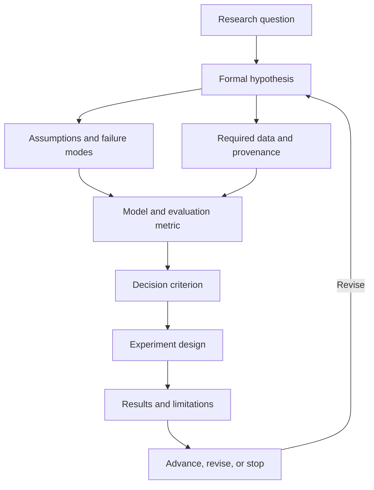

# Prediction Market Research Program
## Phase 0 — Research Charter, Mathematical Documentation Standard, and Repository Scaffold

**Current revision 2.4 — repository/handoff scope recorded 2026-09-20 UTC (2026-09-19 America/Chicago).** [D0007](docs/decisions/D0007-repository-handoff.md) authorizes repository setup and the documentation/evidence handoff, superseding the earlier repository deferral. Production-engine development remains deferred. The proposed diagnosis was canceled before findings. Revision 2.3 research delegation and scientific safeguards remain in force; earlier scope notices below describe their historical adoption.

**Revision 2.3 history — authority adopted 2026-09-18 UTC; header clarified 2026-09-19.** Filename retained for continuity. AMEND-01 through AMEND-04 and Q1 approval remain in [REVIEW-0001](docs/ORIGIN_REVIEW.md) and [D0001](docs/decisions/D0001-primary-research-claim.md). [D0003 / AMEND-05](docs/decisions/D0003-delegated-research-authority.md) authorizes bounded free research and validation decisions by the agent without repeated question-level approval requests. D0004 and D0005 specify the two initial studies. This delegation does not establish empirical support. Repository setup and the production engine remain deferred.

**Starter package:** Read `AGENTS.md`, this charter, `PROJECT_CONTEXT.md`, and `RESEARCH_STATE.md`. A new program begins with Q1 only; after documented user approval, resume the currently authorized question rather than restarting the first task. The larger repository scaffold below is a future reference, not an instruction to create every component now.

---

# 0. Purpose

**Research authority addendum — revision 2.3, 2026-09-18; repository deferral superseded by D0007:** [D0003 / AMEND-05](docs/decisions/D0003-delegated-research-authority.md) supersedes repeated user-stop requirements within delegated free research and bounded validation. Research gates and evidence requirements remain; their decisions are now made and recorded by the agent under delegated authority. Repository setup, production engine, paid work, and trading remain deferred/outside scope. Earlier revision 2.2 scope is historical, preserved in prior Q2 package and decision records. Older user-stop clauses below apply outside this delegation.

This project investigates whether an AI-assisted quantitative system can identify **repeatable, economically meaningful, out-of-sample prediction-market edge**.

The purpose is **not** to immediately build a trading bot, automate execution, or optimize for short-term profit.

The first objective is to understand the problem rigorously enough to define the **evaluation engine** that will later determine whether any proposed forecasting or trading method is actually better than the market after uncertainty, costs, and execution constraints.

The project therefore proceeds in the following order:

\[
\text{Problem Definition}
\rightarrow
\text{Mathematical Formalization}
\rightarrow
\text{Evidence Collection}
\rightarrow
\text{Evaluation Design}
\rightarrow
\text{Experiment Design}
\rightarrow
\text{Paper Validation}
\rightarrow
\text{Small Live Validation}
\rightarrow
\text{Automation}
\]

No stage may be skipped without an explicit user-approved methodological amendment. A stage may be judged infeasible; record why and what evidentiary limitation that creates. In particular, historical AI testing that cannot exclude outcome contamination must not be described as clean historical validation. Prospective confirmation may be proposed as an alternative through a recorded amendment.

---

# 1. Governing Principle

We will advance incrementally.

At every stage:

1. State the research question.
2. Formalize it mathematically when possible.
3. Identify what must be known to answer it.
4. List assumptions.
5. Gather evidence.
6. Define measurable criteria.
7. Record uncertainty.
8. Record what would falsify the current hypothesis.
9. Make an explicit decision:
   - `ADVANCE`
   - `REVISE`
   - `STOP`
10. Do not begin the next stage until the decision is documented.

No live trading is permitted during problem definition, historical evaluation, or paper validation. Small live validation is a separate, explicitly authorized pilot stage.

### Decision authority

The agent prepares an evidence-backed recommendation of `ADVANCE`, `REVISE`, or `STOP`. The user approves closure of each Level-1 question and phase transition. Record recommendation and approval separately; silence is not approval. Routine research and documentation within approved scope may proceed autonomously.

### Exploration and confirmation

Literature review, data-availability checks, mathematical derivations, and clearly labeled synthetic checks may be used to understand an active question. They do not establish empirical edge. Empirical exploratory experiments require a question, declared inputs, provenance, leakage controls, and an exploratory label; register the plan and log changes. Confirmatory experiments additionally require a frozen protocol and untouched evaluation data. Prospective forecast collection can establish a sample under a documented protocol without simulated trading or a prior claim of edge. It does not itself authorize paper trading.

Choose the next action within the approved scope; these distinctions do not authorize solving later questions during Q1.

---

# 2. Mathematical Documentation Standard

This repository should use mathematical notation wherever the problem is quantitative.

The goal is to prevent vague language such as:

- "the model seems better";
- "the edge looks large";
- "the market seems wrong";
- "the strategy performed well";
- "confidence is high".

These statements must instead be translated into explicit variables, equations, estimators, and measurable criteria.

---

## 2.1 Core notation

For market \(i\) observed at time \(t\):

\[
p_{i,t}^{mkt}
\]

denotes the market-implied probability.

\[
\hat{p}_{i,t}^{model}
\]

denotes the model-generated event probability.

\[
y_i \in \{0,1\}
\]

denotes the resolved outcome.

Define raw model-market disagreement as:

\[
\Delta_{i,t}
=
\hat{p}_{i,t}^{model}
-
p_{i,t}^{mkt}
\]

This is **not yet edge**.

---

## 2.2 Executable expected value

Let:

\[
c_{i,t}
\]

represent entry cost per contract.

Let:

\[
f_{i,t}
\]

represent fees.

Let:

\[
s_{i,t}
\]

represent expected spread/slippage cost.

Let:

\[
u_{i,t}
\]

represent a conservative penalty for model uncertainty.

Then a preliminary executable expected value quantity may be defined as:

\[
EV_{i,t}
=
\hat{p}_{i,t}^{model}
-
c_{i,t}
-
f_{i,t}
-
s_{i,t}
-
u_{i,t}
\]

This expression is illustrative only.

The exact definition must be derived from the contract payoff structure and validated before use.

Subtracting a price from a probability presumes an explicitly normalized binary payoff and compatible units. Fees, spread, and slippage must be defined without overlap; an executable entry price may already contain some of these effects. A conservative uncertainty adjustment is a decision adjustment, not automatically an expected cash expense. Expected cash profit and any risk-adjusted decision quantity must be separately named and defined before use.

---

## 2.3 Forecast quality

Candidate probabilistic scoring rules include Brier score and log loss. Q1 nominates a primary dependent variable. Additional losses may be supporting diagnostics; a later co-primary role requires an explicitly approved inference and multiplicity specification. Metric roles must be frozen before confirmatory outcomes are examined.

### Brier score

\[
BS
=
\frac{1}{N}
\sum_{i=1}^{N}
(\hat{p}_i-y_i)^2
\]

### Log loss

\[
LL
=
-\frac{1}{N}
\sum_{i=1}^{N}
\left[
y_i \log(\hat{p}_i)
+
(1-y_i)\log(1-\hat{p}_i)
\right]
\]

Possible market-relative improvement metric:

\[
\Delta BS
=
BS_{market}
-
BS_{model}
\]

where:

\[
\Delta BS > 0
\]

implies the model outperformed the chosen market-probability benchmark under Brier score.

---

## 2.4 Calibration

For forecasts grouped into probability bins \(B_k\):

\[
\text{CalibrationError}_k
=
\left|
\frac{1}{|B_k|}
\sum_{i \in B_k} y_i
-
\frac{1}{|B_k|}
\sum_{i \in B_k} \hat{p}_i
\right|
\]

Calibration must be evaluated separately from realized profit.

---

## 2.5 Trading performance

If paper or live trading is eventually justified, relevant quantities may include:

\[
R_t
\]

for realized return over interval \(t\).

\[
\bar{R}
=
\frac{1}{T}
\sum_{t=1}^{T} R_t
\]

Maximum drawdown should be measured explicitly.

A Sharpe-like statistic may be considered:

\[
S
=
\frac{\mathbb{E}[R-r_f]}
{\sigma(R)}
\]

but only if assumptions and sampling frequency make the statistic meaningful.

---

## 2.6 Documentation rule

Any important project claim should preferably have one of the following forms:

### Mathematical statement

\[
H_0:
\mu_{model}
\le
\mu_{benchmark}
\]

versus

\[
H_1:
\mu_{model}
>
\mu_{benchmark}
\]

### Empirical statement

> On the held-out test set of \(N=...\) markets, the model achieved \(BS=...\) versus \(BS=...\) for the benchmark.

### Decision statement

> Because the predefined criterion \(X\) was not satisfied, the project does not advance to paper trading.

Avoid narrative claims when a formal statement is possible.

---

# 3. Level 1 — Questions We Must Answer First

These are the top-level questions.

Do not yet attempt to solve deeper implementation problems beneath them.

---

## Q1. What exactly are we trying to prove?

Candidate primary hypothesis:

\[
H_0:
\text{The model provides no incremental forecasting value over the market benchmark}
\]

\[
H_1:
\text{The model provides measurable incremental forecasting value over the market benchmark}
\]

Possible secondary hypothesis:

\[
H_0:
\mathbb{E}[EV_{net}] \le 0
\]

\[
H_1:
\mathbb{E}[EV_{net}] > 0
\]

Questions:

- Is our primary objective forecast quality?
- Market-relative forecasting improvement?
- Positive expected value?
- Realized profitability?
- Risk-adjusted profitability?
- Persistence across time?
- Performance within a specific market class?

### Required decision

Q1 chooses a candidate primary claim, candidate dependent variable, intended comparator role, secondary claim priorities, and the meaning and units of the minimum worthwhile effect. It identifies every unresolved parameter, its later question, and the evidence needed to bind it. Final benchmark construction, market and horizon selection, numerical effect thresholds, and evaluation protocol remain subject to their later questions.

Gate 1 is a user decision approving or revising this claim framing and its dependency register. Q1 approval does not mean that a fully specified empirical hypothesis has been approved or tested. Only an explicit user instruction authorizes the next named question.

Before a confirmatory protocol is frozen, reconcile the original Q1 claim with all later approved choices in a linked final specification. No material placeholders may remain. Changes to the objective or target claim require a new user decision; changes after freezing also require a protocol amendment and an evidence-impact assessment.

---

## Q2. What does "edge" mean?

We must distinguish:

\[
\text{forecast advantage}
\neq
\text{price advantage}
\neq
\text{executable EV}
\neq
\text{realized profit}
\]

The following decomposition is a conceptual checklist, not a dimensionally valid equality. Forecast-score improvement, probability disagreement, and cash profit have different units. Any operational relationship must be derived from an explicit payoff, decision policy, and execution model under Q2.

Potential decomposition:

\[
\text{Observed Edge}
=
\text{Forecast Advantage}
-
\text{Costs}
-
\text{Execution Friction}
-
\text{Model Uncertainty}
\]

We must determine whether "edge" refers to:

- calibration improvement;
- lower Brier score;
- lower log loss;
- positive net expected value;
- positive realized P\&L;
- positive risk-adjusted P\&L;
- persistence over repeated out-of-sample samples.

### Required decision

Define the mathematical and operational meaning of edge.

**Gate 2:** No profitability claim may be made without predefined statistical and economic criteria.

---

## Q3. What is the correct benchmark?

Potential benchmarks include:

\[
p^{mkt}_{t}
\]

market probability at observation time;

\[
p^{close}
\]

closing probability;

\[
p^{base}
\]

historical base-rate estimate;

\[
p^{simple}
\]

simple statistical model;

\[
p^{LLM}
\]

AI forecast;

\[
p^{hybrid}
\]

AI + deterministic model.

### Required decision

Select one primary benchmark and define secondary benchmarks.

**Gate 3:** Astra must be compared against a strong baseline, not against intuition.

---

## Q4. Which market classes are theoretically suitable?

Prediction markets differ in:

- liquidity;
- information arrival rate;
- latency sensitivity;
- resolution clarity;
- historical data availability;
- feature availability;
- market efficiency;
- participant sophistication;
- horizon length.

Potential categories:

- macroeconomic releases;
- Federal Reserve decisions;
- weather;
- sports;
- cryptocurrency;
- financial thresholds;
- technology/product events;
- geopolitical events;
- entertainment;
- very short-duration markets.

### Required decision

Choose the initial market universe.

**Gate 4:** Do not model every market.

---

## Q5. What information is the system allowed to use?

Possible information classes:

- historical market prices;
- order-book data;
- official government datasets;
- economic releases;
- financial data;
- news;
- expert forecasts;
- polling;
- weather data;
- social media;
- other prediction markets;
- derived statistical features.

For every feature \(x_j\), we must know:

\[
t_{available}(x_j)
\le
t_{decision}
\]

Otherwise, the feature introduces look-ahead bias.

### Required decision

Create:

- approved source taxonomy;
- timestamp rules;
- source-provenance rules;
- revision-data rules.

**Gate 5:** No empirical experiment until leakage controls are defined. Data-feasibility checks may inform those controls but cannot be presented as evidence of edge.

---

## Q6. Can historical testing be performed honestly?

Failure modes include:

- look-ahead bias;
- revised-data leakage;
- survivorship bias;
- cherry-picking;
- assuming impossible fills;
- ignoring spread;
- ignoring fees;
- overfitting;
- repeated testing on the same holdout sample;
- threshold optimization on evaluation data;
- AI training, retrieval, or tool access that exposes historical outcomes;
- treating repeated forecasts or related markets as independent observations.

Timestamp restrictions on supplied sources do not establish that an AI model lacks historical outcome knowledge. Record the model version and contamination assessment. If contamination cannot be excluded, historical AI results remain exploratory; propose a preregistered prospective evaluation for confirmation. Define temporal and related-event grouping rules as well as disjoint data partitions.

Possible data partition:

\[
D
=
D_{train}
\cup
D_{validation}
\cup
D_{test}
\]

with:

\[
D_{train}
\cap
D_{validation}
=
\emptyset
\]

\[
D_{validation}
\cap
D_{test}
=
\emptyset
\]

\[
D_{train}
\cap
D_{test}
=
\emptyset
\]

### Required decision

Freeze the backtesting protocol before measuring final strategy performance.

**Gate 6:** Evaluation methodology must precede optimization.

---

## Q7. How should Astra represent uncertainty?

A forecast such as:

\[
\hat{p}=0.63
\]

is insufficient by itself.

We also need:

- uncertainty;
- source disagreement;
- assumptions;
- missing evidence;
- confidence in reasoning;
- timestamp;
- provenance.

Potential structured output:

```yaml
event_probability: 0.63
uncertainty_interval: [0.55, 0.70]
base_rate: 0.49
confidence_in_analysis: null # Undefined until its meaning and validation are specified
key_evidence_for: []
key_evidence_against: []
critical_assumptions: []
missing_information: []
source_timestamps: []
model_version: ""
prompt_version: ""
```

The example values above are illustrative. An uncertainty interval requires a stated construction and interpretation; it is not validated merely because the model emits two endpoints. Self-reported confidence is not a calibrated statistic.

### Required decision

Define a machine-readable forecast schema.

**Gate 7:** Astra may not directly generate trade instructions from unstructured prose.

---

## Q8. What belongs to Astra versus deterministic software?

Potential Astra responsibilities:

- research;
- evidence synthesis;
- decomposition;
- base-rate identification;
- scenario analysis;
- contradiction detection;
- qualitative evidence assessment;
- probability estimation.

Potential deterministic responsibilities:

- API ingestion;
- normalization;
- fee calculations;
- spread calculations;
- expected-value calculations;
- position accounting;
- backtesting;
- statistical testing;
- experiment reproducibility;
- risk limits;
- execution.

### Required decision

Draw the architecture boundary.

**Gate 8:** Financial arithmetic, scoring, accounting, and risk constraints should be deterministic.

---

## Q9. What would invalidate the project?

Possible kill conditions:

\[
\Delta BS \le 0
\]

on held-out data;

\[
EV_{net} \le 0
\]

after conservative cost assumptions;

or observed improvement disappears under:

- alternate prompts;
- alternate time periods;
- alternate market classes;
- realistic fill assumptions;
- bootstrap confidence intervals;
- multiple-comparison correction.

These examples are candidate diagnostics, not adopted rejection or stopping rules. A nonpositive sample estimate alone need not rule out a worthwhile population effect. Failure to establish an effect is not automatically evidence against it. Any future rule must specify uncertainty, dependence, multiplicity, stopping, and the claim's population and scope. Failure in a different population or for a different method need not invalidate the original narrow claim. A practical decision to stop research can be justified by cost or infeasibility without proving universal absence of edge.

### Required decision

Define project kill criteria.

**Gate 9:** Failure is an acceptable research result.

---

## Q10. What justifies experimentation?

Before paper trading intended to validate a strategy:

- sufficient sample size;
- reproducible data pipeline;
- no known leakage;
- benchmark frozen;
- statistically meaningful improvement;
- economically meaningful effect size;
- held-out validation;
- robustness checks;
- full documentation.

### Required decision

Define advancement criteria from research to experiment.

**Gate 10:** No strategy-validation paper-trading experiment until these criteria are satisfied under a user-approved protocol. Evidence collection and prospective forecast evaluation may precede this gate under their own approved scope. Where honest historical evaluation is infeasible, document a methodological amendment rather than silently treating contaminated results as validation.

---

# 4. Evaluation Engine — Problem We Are Ultimately Building Around

The evaluation engine is **not** a trading strategy.

It is the system that determines whether a strategy, model, prompt, feature set, or forecasting method deserves further consideration.

The evaluation engine should eventually answer:

\[
\boxed{
\text{Did method } M
\text{ outperform benchmark } B
\text{ under protocol } P
\text{ with economically meaningful magnitude?}
}
\]

---

## 4.1 Evaluation engine inputs

Potential inputs:

\[
E
=
\{
\text{forecast},
\text{market price},
\text{timestamp},
\text{outcome},
\text{costs},
\text{liquidity},
\text{model metadata},
\text{source metadata}
\}
\]

---

## 4.2 Evaluation engine outputs

Potential outputs:

- Brier score;
- log loss;
- calibration error;
- benchmark-relative improvement;
- simulated net EV;
- realized paper P\&L;
- maximum drawdown;
- hit rate;
- exposure;
- turnover;
- confidence intervals;
- sensitivity results;
- performance by category;
- performance by forecast horizon;
- performance by market liquidity;
- degradation over time.

---

## 4.3 Evaluation engine invariants

The engine should eventually enforce:

1. No future information.
2. Every forecast has a timestamp.
3. Every model run has a version.
4. Every prompt has a version.
5. Every source has provenance.
6. Every trade simulation uses realistic costs.
7. Every experiment declares its benchmark before execution.
8. Every experiment declares its success criteria before execution.
9. Test data cannot silently become training data.
10. Results must be auditable from versioned repository records, lawfully retained data or a documented access manifest, and stored run inputs and outputs. Deterministic evaluation must be reproducible from those recorded inputs. Exact regeneration of a model output is a separate property: record the model, settings, prompts, tools, timestamps, and limitations, and disclose when regeneration is unavailable. Do not call a run reproducible if the necessary evidence cannot be inspected.

---

# 5. Repository Requirements

The repository is part of the research methodology.

It should make it difficult to accidentally:

- skip a decision gate;
- lose provenance;
- overwrite assumptions;
- leak future information;
- confuse exploratory analysis with final evidence;
- confuse research notes with approved specifications.

---

## 5.1 Required repository properties

The repo should support:

- version-controlled research questions;
- mathematical definitions;
- decision records;
- source provenance;
- dataset manifests;
- experiment manifests;
- reproducible evaluation;
- prompt versioning;
- model versioning;
- benchmark versioning;
- explicit phase boundaries;
- clear separation between exploratory and confirmatory analysis.

---

## 5.2 Minimal starting files

Start with exactly four governing Markdown files at the repository root:

- `prediction_market_research_charter_v2.md`: this charter.
- `AGENTS.md`: agent operation, guardrails, and learning protocol.
- `PROJECT_CONTEXT.md`: confirmed intent and unresolved resource constraints.
- `RESEARCH_STATE.md`: active question, decisions, knowledge log, and handoff.

Create decision records and other specialized files only as active research needs them. If the charter is later moved into `docs/charter/`, update all references and retain one authoritative copy.

## 5.3 Possible future repository scaffold

```text
prediction-market-research/
│
├── README.md
├── AGENTS.md
├── pyproject.toml
├── .gitignore
│
├── docs/
│   ├── charter/
│   │   └── research-charter.md
│   │
│   ├── math/
│   │   ├── notation.md
│   │   ├── scoring-rules.md
│   │   ├── expected-value.md
│   │   ├── calibration.md
│   │   └── statistical-testing.md
│   │
│   ├── questions/
│   │   ├── level-1.md
│   │   ├── q1/
│   │   ├── q2/
│   │   └── ...
│   │
│   ├── decisions/
│   │   ├── DECISION_TEMPLATE.md
│   │   └── D0001-*.md
│   │
│   ├── architecture/
│   │   ├── evaluation-engine.md
│   │   ├── data-flow.md
│   │   └── system-boundaries.md
│   │
│   └── experiments/
│       ├── EXPERIMENT_TEMPLATE.md
│       └── registry.md
│
├── knowledge/
│   ├── claims/
│   ├── sources/
│   ├── assumptions/
│   ├── open-questions/
│   └── rejected-hypotheses/
│
├── data/
│   ├── raw/
│   ├── interim/
│   ├── processed/
│   └── manifests/
│
├── prompts/
│   ├── forecasting/
│   ├── evidence-synthesis/
│   └── registry.yaml
│
├── schemas/
│   ├── forecast.schema.json
│   ├── experiment.schema.json
│   ├── source.schema.json
│   └── decision.schema.json
│
├── src/
│   ├── ingestion/
│   ├── normalization/
│   ├── forecasting/
│   ├── evaluation/
│   ├── backtesting/
│   └── reporting/
│
├── tests/
│   ├── unit/
│   ├── integration/
│   ├── leakage/
│   └── reproducibility/
│
├── experiments/
│   ├── exploratory/
│   ├── preregistered/
│   └── completed/
│
└── outputs/
    ├── figures/
    ├── tables/
    └── reports/
```

---

# 6. Knowledge Scaffold

The project needs a structure for managing what we learn before experiments begin.

Knowledge should not live only in chat history.

Use the following conceptual scaffold:



Every experiment must trace backward through this structure.

An experiment without a linked research question, hypothesis, benchmark, and success criterion should be considered invalid.

---

# 7. Knowledge Object Types

Each important item learned should become one of the following repository objects.

---

## 7.1 Claim

A proposition believed to be true.

Example:

> Market prices at decision time may be used as the primary benchmark.

Each claim should contain:

- claim ID;
- statement;
- mathematical form if applicable;
- evidence;
- confidence;
- status;
- source links;
- related decisions.

---

## 7.2 Assumption

An unverified condition required by a model or experiment.

Example:

\[
\text{quoted ask price}
\approx
\text{achievable execution price}
\]

This assumption would likely be too strong and therefore require testing.

---

## 7.3 Open question

Something unresolved that blocks downstream work.

---

## 7.4 Decision

An explicit project choice.

---

## 7.5 Rejected hypothesis

A previously plausible hypothesis rejected under a stated decision rule. Mere failure to obtain sufficient evidence is inconclusive, not automatically a rejection.

Rejected hypotheses should remain in the repository.

They are part of project knowledge.

---

## 7.6 Experiment

A preregistered test connecting:

\[
\text{Hypothesis}
\rightarrow
\text{Data}
\rightarrow
\text{Method}
\rightarrow
\text{Metric}
\rightarrow
\text{Decision Rule}
\]

---

# 8. Experiment Groundwork

Empirical experiments should not begin until their question and evaluation purpose are defined. Distinguish exploratory plans from frozen confirmatory protocols as specified in section 1.

Register every empirical experiment before running it using a structure similar to the following. Exploratory plans may change if amendments are logged; confirmatory protocols must be frozen before examining evaluation outcomes:

```yaml
experiment_id: EXP-0001
experiment_type: # exploratory or confirmatory
protocol_version:
protocol_frozen_at:
contamination_assessment:
unit_of_analysis:
related_event_grouping:
test_data_exposure_status:

research_question:
hypothesis_null:
hypothesis_alternative:

dataset:
observation_window:
market_universe:

features_allowed:
features_prohibited:

model_version:
prompt_version:

benchmark:

primary_metric:
secondary_metrics:

success_threshold:
failure_threshold:

cost_model:

known_assumptions:
known_failure_modes:

train_window:
validation_window:
test_window:

decision_after_result:
```

---

# 9. Evaluation Engine Development Sequence

The engine should be built incrementally around research needs.

```text
Stage A
Define outcomes and timestamps
        ↓
Stage B
Define benchmark probabilities
        ↓
Stage C
Implement forecast scoring
        ↓
Stage D
Implement calibration analysis
        ↓
Stage E
Implement uncertainty / confidence intervals
        ↓
Stage F
Implement cost-aware EV simulation
        ↓
Stage G
Implement realistic fill / liquidity assumptions
        ↓
Stage H
Implement paper-trade accounting
        ↓
Stage I
Implement strategy comparison
        ↓
Stage J
Implement robustness / sensitivity testing
```

Each stage should be justified by a research requirement.

Do not build components merely because they are technically interesting.

---

# 10. Questions We Deliberately Defer

Do **not** solve these yet:

- How much money should be deposited?
- How can we make \$2,000 per month?
- What position-sizing algorithm should be used?
- Should trades be automated?
- Which specific strategy should be deployed?
- What is the optimal entry price?
- Should Kelly criterion be used?
- Which cloud architecture should host the system?
- Which database should be selected?
- Which frontend should be built?
- Should multiple venues be traded?
- How frequently should the system trade?

These depend on earlier findings.

---

# 11. Initial Research Sequence

The first research cycle should proceed in dependency order:

1. Define the hypothesis.
2. Formalize "edge."
3. Define benchmarks.
4. Define eligible market classes.
5. Define information constraints.
6. Define timestamp integrity.
7. Define the evaluation protocol.
8. Define Astra forecast schema.
9. Separate AI reasoning from deterministic computation.
10. Define kill criteria.
11. Define advancement criteria.
12. Only then design Experiment 001.

---

# 12. Decision Record Template

## Decision [ID]

**Question**

What are we deciding?

**Mathematical form**

If applicable:

\[
...
\]

**Why it matters**

What downstream work depends on this?

**Evidence**

What evidence has been gathered?

**Alternatives considered**

What other choices were plausible?

**Assumptions**

What assumptions remain?

**Unknowns**

What remains uncertain?

**Decision**

`ADVANCE` / `REVISE` / `STOP`

**Rationale**

Why?

**What this unlocks**

What may now be investigated?

**What remains prohibited**

What are we still not ready to do?

---

# 13. Instruction to Astra

Treat this repository as a **sequential quantitative research program**, not as a software-build request.

Do not jump ahead to implementation.

For each Level-1 question:

1. Decompose it into the minimum necessary Level-2 questions.
2. Convert vague concepts into mathematical definitions.
3. Define notation before using variables.
4. Identify empirical claims requiring external verification.
5. Identify statistical questions.
6. Identify assumptions.
7. Identify failure modes.
8. Identify possible data leakage.
9. Define what evidence would falsify the hypothesis.
10. Propose objective evidence needed to answer the question.
11. Write findings into the appropriate repository knowledge objects.
12. Present unresolved choices to the user.
13. Stop at the decision gate.

Use LaTeX-style Markdown notation throughout:

\[
x = y
\]

for display mathematics and:

\[
p \in [0,1]
\]

for probability statements.

Prefer equations, tables, schemas, and explicit definitions over imprecise prose.

Do not treat plausible reasoning as evidence of trading edge.

Do not allow an experimental result to become a permanent project belief unless it is documented, reproducible, and connected to evidence.

A proposal to begin small live validation requires completed research, valid evaluation evidence, and paper validation under approved advancement rules. Historical limitations require the documented amendment described in section 1.

Before any live pilot, obtain explicit user authorization for a concrete protocol defining capital, maximum loss, duration, execution permissions, monitoring, and stop conditions. A passed research gate alone does not authorize spending or trading.

Broader live deployment or automation requires successful small live validation and a separate user-approved decision. Do not require a live pilot to have already occurred before proposing that pilot.

---

# 14. First Task for Astra

This section records the program's initial task. Once that task is approved, follow the next scope explicitly authorized by the user, as documented in the decision register; do not reset to Q1 or treat this section as authorizing every later question.

Begin with **Q1 only**.

Do not solve Q2-Q10.

For Q1:

1. Decompose "What exactly are we trying to prove?" into Level-2 questions.
2. Define candidate mathematical hypotheses.
3. Identify the dependent variables.
4. Identify the minimum economically meaningful effect size we would eventually need to define.
5. Identify which quantities are currently undefined.
6. Identify what evidence is needed before Q1 can be closed. Distinguish the choice of a candidate research claim from downstream choices of benchmark, market, effect size, and final evaluation protocol; record those dependencies without solving Q2–Q10.

   At the first Q1 decision, evidence consists of documented intent, mathematical coherence, explicit limits, and a complete dependency map. Evidence that the claim is true is not a prerequisite for choosing to investigate it. Experimental readiness remains a separate later approval.
7. Create the proposed first decision record.
8. Stop before making the decision on behalf of the user.

The objective is not to produce an answer quickly.

The objective is to construct a research foundation strong enough that later experiments can fail honestly.
