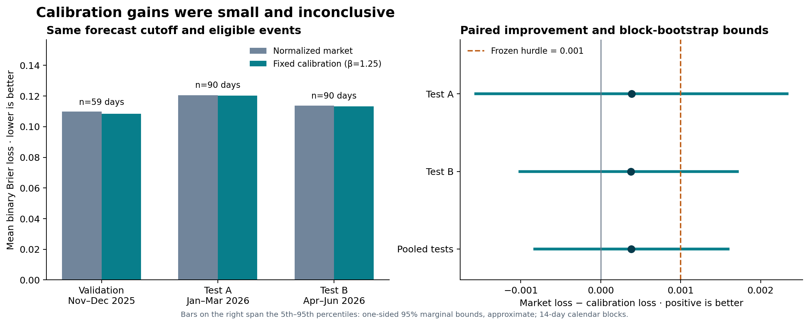
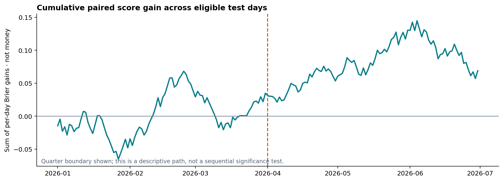

# Calibration gains were small and inconclusive

EXP-0001 · 2026-09-18 · historical forecasting research, no trading

## Finding

The candidate did not establish the frozen replicated forecasting claim. The result must not be presented as validated edge, even if a pooled point estimate is positive. This study is complete; its test periods cannot be reused to validate a revised method.

The method was fixed before test results: a single exponent β=1.25, selected using training data alone, applied to the event's normalized market probabilities. The primary comparator was the normalized market, so normalization alone cannot account for a reported improvement. The split-specific details below include unsuccessful results as well as favorable ones.

## What was tested

One year of daily NYC Central Park temperature-bracket events, July 2025–June 2026, from Kalshi's public historical archive. Forecasts use bid/ask midpoint candles whose reported end timestamps fall in the declared window before noon New York time **the day before** the target date. All brackets are grouped into one event-day; they are not independent observations.

Training: July–October 2025. Validation: November–December 2025. Test A: January–March 2026. Test B: April–June 2026. The chosen parameter was never refitted. Every retained day has a complete, coherent bin set, matching quote window, and valid one-hot settlement.

| Period | Eligible days | Market Brier | Candidate Brier | Gain | Lower bound | Upper bound |
| --- | ---: | ---: | ---: | ---: | ---: | ---: |
| Training | 118/123 | 0.111409 | 0.110638 | 0.000771 | unavailable | unavailable |
| Validation | 59/61 | 0.109799 | 0.108318 | 0.001482 | unavailable | unavailable |
| Test A | 90/90 | 0.120594 | 0.120207 | 0.000387 | -0.001565 | 0.002332 |
| Test B | 90/91 | 0.113686 | 0.113308 | 0.000378 | -0.001010 | 0.001708 |
| Pooled tests | 180/181 | 0.117140 | 0.116757 | 0.000383 | -0.000824 | 0.001594 |

Lower/upper columns are the bootstrap 5th/95th percentiles, interpreted as one-sided 95% marginal bounds, not a simultaneous 95% interval. They are approximate under dependence/stationarity assumptions. The primary method used 14-day calendar blocks and 10,000 replicates per period. The frozen 7-day sensitivity is included in results.json and cannot replace a failed primary result. The 0.001 hurdle is a scientific screening choice, not an economic dollar threshold.

## Coverage and exclusions

| Split | Expected dates | Metadata present | Returned contracts | Eligible dates | Excluded dates |
| --- | ---: | ---: | ---: | ---: | ---: |
| train | 123 | 123 | 738 | 118 | 5 |
| validation | 61 | 61 | 366 | 59 | 2 |
| test_a | 90 | 90 | 540 | 90 | 0 |
| test_b | 91 | 91 | 546 | 90 | 1 |

- incomplete_quotes: 7 event-days (reasons can overlap).
- missing_candle_window: 7 event-days (reasons can overlap).
- training_label_not_available: 1 event-days (reasons can overlap).
- not_created_and_open_at_cutoff: 2 event-days (reasons can overlap).
- zero_or_missing_mass: 2 event-days (reasons can overlap).

Operational minimum coverage/sample requirements passed: **true**. These are not a power guarantee. The effect describes eligible archived event-days; it does not establish performance on excluded dates or show that missingness is random. Full per-date reasons are in coverage.csv; split-specific counts are in fit-lock.json.

## What has and has not been validated

- Validated here: deterministic arithmetic, input hashes/URLs, timestamp filters and New York daylight-saving handling, train-only parameter fitting, equal-event scoring, and the fixed out-of-time comparison. An independent code/method review occurred before test exposure.
- The study uses archived data reconstructed today. It cannot certify original rule versions, deleted listings, exact live candle-publication latency, or actual quote-update freshness. Candle age is not necessarily quote age.
- No historical LLM event forecasts were used. AI assisted research design and review; the study does not demonstrate an AI-specific forecasting advantage.
- No fill, fee, position-sizing, risk-capital, or net-profit model was evaluated. Midpoints are not executable purchase prices. The charts show score units, not money.
- One city, one year, and two test quarters do not establish indefinite persistence or generalization. A prospective sample is needed before a stronger claim; collecting future outcomes takes time.

## Decision and next evidence

REVISE the research direction or retain the market baseline; do not claim success or advance to trading from this result.

The user delegated continued research, so no repeated question-level approval was required. This was one bounded study with a frozen family and reporting rule. The test outcomes are now exposed. Any revised candidate requires fresh confirmation; no city, horizon, parameter family, or cutoff was changed after seeing this test.

The repository and production engine remain deferred. No paid services, accounts, orders, deposits, or scheduled jobs were used. The audit bundle includes raw responses, request hashes, the local protocol freeze, the pre-exposure amendment, locked fit, all parameter-grid training scores, per-event results, exclusions, and one-off reproduction scripts.

## Sources and audit

- [Kalshi historical routing](https://docs.kalshi.com/getting_started/historical_data): explains the archival cutoff and endpoint split.
- [Historical market schema](https://docs.kalshi.com/api-reference/historical/get-historical-markets): metadata and settlement fields.
- [Historical candle schema](https://docs.kalshi.com/api-reference/historical/get-historical-market-candlesticks): timestamped bid/ask/trade fields. These documents establish API structure, not profitability.

See ../protocol.md, ../amendments.md, ../protocol-freeze.json, ../fit-lock.json and ../results.json. Original source responses were fetched on 2026-09-18 UTC without credentials; request-start times and SHA-256 hashes are in ../request-manifest.jsonl.
